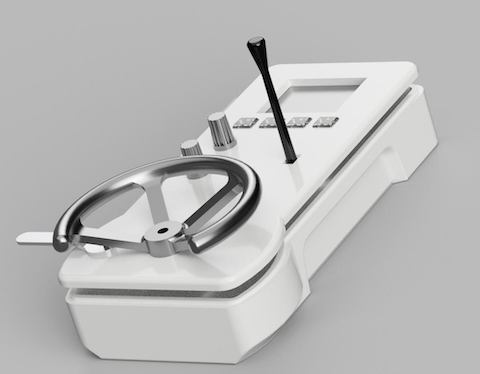

# Train Controller Project

## Overview

**A Realistic DCC Throttle Inspired by Epoch IV.**

This project aims to replicate the functionality and aesthetics of a classic train engine cabin commonly used during the Epoch IV era of model railroading. By combining modern microcontroller capabilities with a nostalgic design, the Train Controller provides an authentic and immersive experience for model train enthusiasts. [More info here...](https://little-railways.es/2025/03/a-realistic-dcc-throttle.html)

The **Train Controller Software Project** is a modular and thread-safe UI system designed for the **Raspberry Pi Pico** using the **Arduino framework** provided by the **earlephilhower core**. It leverages the **TFT_eSPI** library for driving TFT displays and includes enhancements to make the library thread-safe in an RTOS environment.

---

## Features

1. **Raspberry Pi Pico Support**:
   - Built using the **earlephilhower Arduino core**.

2. **TFT_eSPI Integration**:
   - Uses the **TFT_eSPI** library for high-performance TFT display rendering.
   - Configured for an ST7789 driver with 240x320 resolution.

3. **RTOS Use**:
   - Runs on FreeRTOS, enabling multitasking.

4. **Dynamic UI System**:
   - A `PageManager` handles navigation between different UI pages.
   - Includes a `ThreadSafeTFT` wrapper to make `TFT_eSPI` thread-safe using a FreeRTOS semaphore.
   
---

## Requirements

### Hardware
- **Raspberry Pi Pico**
- **TFT Display** (configured for ST7789 driver, 240x320 resolution)
- **Buttons** for navigation (up, down, left, right, OK)

### Software
- **PlatformIO** (recommended for building and uploading)
- **Arduino Framework** (earlephilhower core)

---

## Libraries Used

1. **TFT_eSPI**:
   - High-performance library for driving TFT displays.
   - Configured for the ST7789 driver in this project.

2. **TJpg_Decoder**:
   - Used for rendering JPEG images on the display.

3. **PageManagerLibrary**:
   - A custom library included in this project for managing UI pages.
